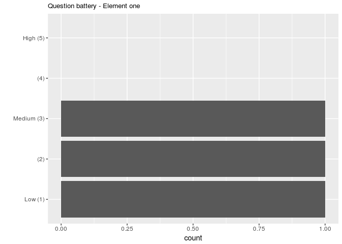
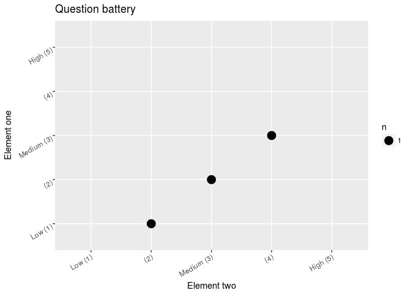

<!-- README.md is generated from README.Rmd. Please edit that file -->
SurveyExactDataImporter
=======================

The goal of SurveyExactDataImporter is to simplify loading of data from the online questionaire system SurveyExact.

Installation
------------

You can install the development version of SurveyExactDataImporter from [github](https://CRAN.R-project.org) with:

``` r
library(devtools)
install_github("henrikmidtiby/SurveyExactDataImporter")
```

How to export data in the proper format from SurveyExact
--------------------------------------------------------

1.  Open the questionaire in SurveyExact
2.  Find the "Dataset" in the sidepanel to the right
3.  Under "Nyeste data" - "Eksporter datasæt" - "Excel XML"
4.  Check all boxes except "Behold linjeskift" in the dialog that appears
5.  Click on "Hent fil"

Example
-------

Load libraries

``` r
library(SurveyExactDataImporter)
library(ggplot2)
```

Load example dataset.

``` r
data <- load_survey_exact_data("data/dataset_1488637_20180512_1825827966544069436.xlsx")
```

Show a summary of the imported data. Note that the factor levels are sorted as specified in SurveyExact and not alphabetically as otherwise is the standard approach (what else to to when it is not specified ...).

``` r
summary(data$data)
#>            s_1           s_2_1          s_2_2          s_2_3  
#>  Option A    :1   Ikke valgt:1   Ikke valgt:1   Ikke valgt:3  
#>  Option B    :1   Valgt     :2   Valgt     :2   Valgt     :0  
#>  Both A and B:1                                               
#>  Neither     :0                                               
#>                                                               
#>          s_6            s_7            s_8        s_3           
#>  Low (1)   :1   Low (1)   :0   Low (1)   :0   Length:3          
#>  (2)       :1   (2)       :1   (2)       :0   Class :character  
#>  Medium (3):1   Medium (3):1   Medium (3):1   Mode  :character  
#>  (4)       :0   (4)       :1   (4)       :1                     
#>  High (5)  :0   High (5)  :0   High (5)  :1                     
#>        stato_1        stato_2        stato_3        stato_4 
#>  Ikke valgt:3   Ikke valgt:3   Ikke valgt:3   Ikke valgt:0  
#>  Valgt     :0   Valgt     :0   Valgt     :0   Valgt     :3  
#>                                                             
#>                                                             
#>                                                             
#>        stato_5 
#>  Ikke valgt:3  
#>  Valgt     :0  
#>                
#>                
#> 
```

Extract information about a certain element in the questionaire.

``` r
get_variable_name(data, 's_6')
#> [1] "Question battery - Element one"
get_variable_name_category(data, 's_6')
#> [1] "Question battery"
get_variable_name_subcategory(data, 's_6')
#> [1] "Element one"
```

Show distribution of answers to a single question (s\_6).

``` r
ggplot(data$data) + 
  geom_bar(aes(s_6)) + 
  scale_x_discrete(drop=FALSE) +
  coord_flip() + 
  labs(subtitle = get_variable_name(data, 's_6'), 
       x = "")
```



Make a scatter plot of answers to two questions (s\_6 and s\_7).

``` r
ggplot(data$data) + 
  geom_count(aes(s_6, s_7)) + 
  scale_x_discrete(drop=FALSE) +
  scale_y_discrete(drop=FALSE) +
  coord_flip() +
  labs(title = get_variable_name_category(data, 's_6'), 
       x = get_variable_name_subcategory(data, 's_6'), 
       y = get_variable_name_subcategory(data, 's_7')) + 
  theme(axis.text.x = element_text(angle = 30, hjust = 1, vjust = 1), 
        axis.text.y = element_text(angle = 30, hjust = 1, vjust = 1))
```


